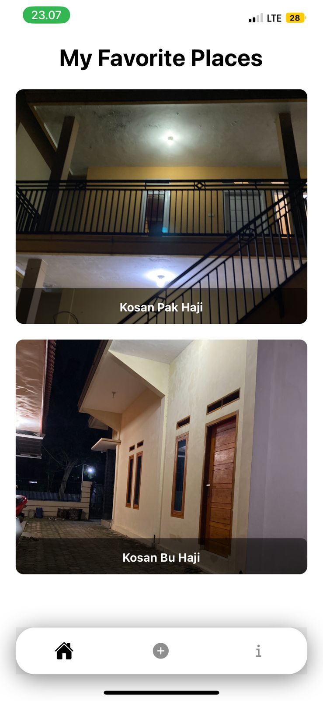
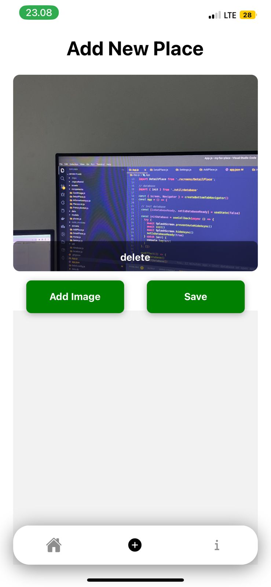
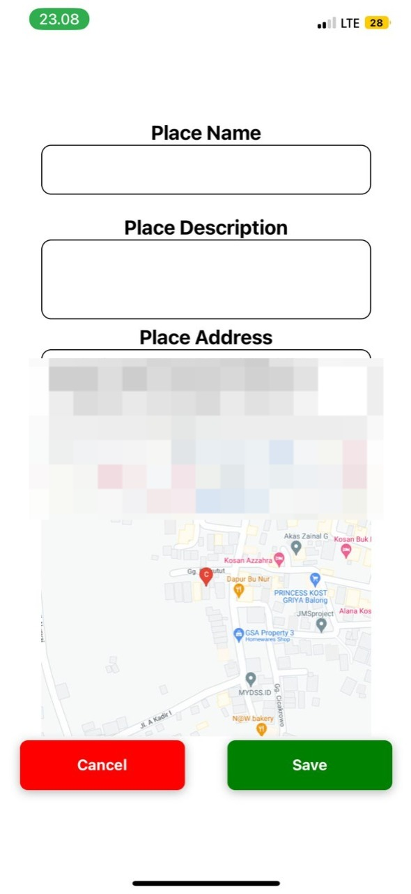
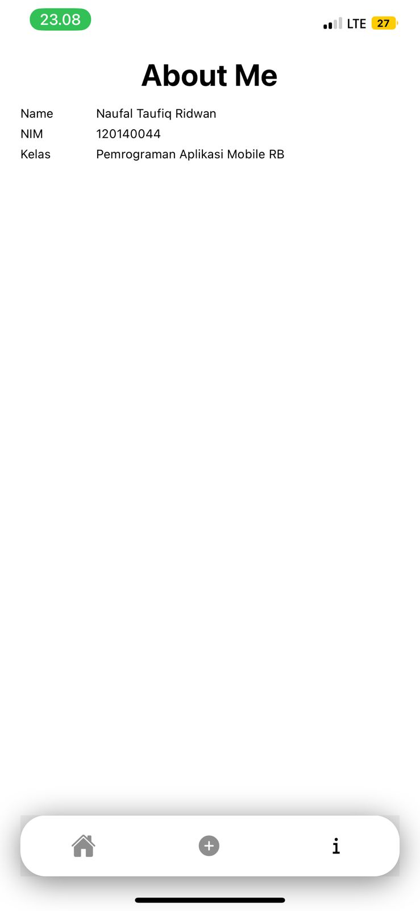

<h1> My Favs Place </h1>
<p> Aplikasi ini berguna untuk mengambil dan menyimpan foto beserta informasi lokasi yang diambil. </p>

# Author
Naufal Taufiq Ridwan<br>
120140044
# Video Demo
https://drive.google.com/file/d/1AdIc4Xk8o7KEj6Rzn7d-fXGBdTz7pCIJ/view
# Daftar Package
- expo-camera
- expo-location

# Cara Install dan Menjalankan
```bash 
    git clone https://github.com/n0l3r/my-fav-place.git
    cd my-fav-place
    npm install
    npm start
```

# Cara Build menggunakan Expo
```bash
    expo build:android
    expo build:ios
```

# Cara Build menggunakan eas
```bash
    eas build --platform android
    eas build --platform ios
```


# Screenshot
<center>
    
    
    
    
</center>


